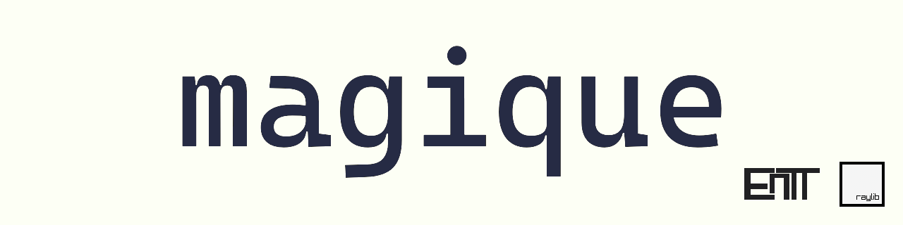

[](https://discord.gg/YAsvnxAmX7)

[](https://opensource.org/licenses/Zlib)

`magique` is a **C++ 20** beginner-friendly cross-platform 2D game engine for programmers (or those yet to be!).
It combines your favourite game libraries (*[raylib](https://github.com/raysan5/raylib), [EnTT](https://github.com/skypjack/entt) and more*) and **many custom
written modules** into a featureful standalone engine.
With an **intutive and easy-to-learn API** and **extensive documenation** it is specifically designed to be the basis of
your game project.

> No fancy interface, no visual helpers, no gui tools or editors... just coding in pure spartan-programmers way.
> Are you ready to enjoy coding?
>
> -- *raylib*

Join the [official discord](https://discord.gg/YAsvnxAmX7) for help, bug reports and discussions.  
Checkout my [YouTube channel](https://www.youtube.com/@gk646-yt) for spotlights, development sessions
and tutorials.  
I used `magique` in a 1-day game-jam to create the winning
entry: [A turtle's journey](https://github.com/gk646/turtles_journey).

---

Most notable features:

- **Easy to learn and use**
    - _**No external dependencies!**_ (all dependencies in the source)
    - All `raylib` functionalities are the same allowing for an easy transition
    - _**Fully documented headers**_, many **_examples_** and **_video guides_**!
    - _**Many examples**_ from single headers to whole games! (see _examples/_)
    - Intuitive public API optimized for maximum usability
    - Extensive logging and error detection with asserts and debugger support
- **Fast and modern**
    - Internally uses _**custom datastructures and algorithms**_ to provide maximum performance
    - Explicitly _**optimized for compile time**_ internally and externally!
    - Takes advantage of _**multithreading, SIMD, data-driven design and cache locality**_ where possible
- **Large feature set with `pay for what you use` policy**
    - Asset-Packing and Loading with **compression, encryption and checksum support**
    - Automatic texture stitching into configurable atlases
    - Task based loading interface handling load-priority and background loading of assets
    - _**Procedural particle system**_ inspired by Godot4
    - Persistence API for gamesaves and gameconfig with typesafe data access
    - Typesafe C++ scripting system allowing for custom methods and classes with native speed
    - Supports _**[Tiled](https://www.mapeditor.org/) tilemaps and tilset exports**_ (.tmx, .tsx)
    - Object-oriented UI framework with automatic scaling and intuitive anchoring and alignment tools
    - Powerful in-game console with custom commands and interaction with the game
    - _**Achievements, Localization, 2DSound, AIAgent, VirtualClock, and many more!**_
- **Multiplayer support**
    - Seamless transition between local and global networking with a unified API
- **Steam integration**
    - Provided a Steam SDK, allows access to _**steam features**_ like matchmaking and chat

`magique` is using the following popular libraries:

- **[raylib](https://github.com/raysan5/raylib)** _(5.5-dev)_: rendering, resource loading, sound,...
- **[EnTT](https://github.com/skypjack/entt)** _(3.16)_: fast and modern entity-component system
- **[ankerl](https://github.com/martinus/unordered_dense)** _(4.8.1)_: optimized dense hashmap and hashset
- **[FastNoiseLite](https://github.com/Auburn/FastNoiseLite)** _(1.1.1)_: fast and easy noise generation
- **[GameNetworkingSockets](https://github.com/ValveSoftware/GameNetworkingSockets)** _(1.41-dev)_: local networking via
  IP
- **[Steam SDK](https://partner.steamgames.com/)** _(1.61)_:  steam features and global P2P networking
- **[glaze](https://github.com/stephenberry/glaze)** _(6.0.1)_: Fast JSON serialization with reflection support

### Quickstart

Checkout the [video guide](https://www.youtube.com/watch?v=6mQwd6NjNcw) for a step by step explanation!

1. Download or clone `magique`
2. Set up an emtpy new project folder and create the following files:

- **_main.cpp_**
  ```c++
  #include <magique/magique.hpp>
  using namespace magique; // Recommended and officially supported
  struct MyGame final : Game
  {
      void updateGame(GameState gameState) override { printf("Hello World!\n"); }
      void drawGame(GameState gameState, Camera2D& camera) override { DrawRectangle(0, 0, 50, 50, RED); }
  };
  
  int main()
  {
      MyGame game{};
      return game.run();
  }
  ```

- _**CMakeLists.txt**_ (You need to set an actual path to the magique directory)

  ```cmake
  cmake_minimum_required(VERSION 3.20)
  project(MyGame)
  
  add_executable(MyGame main.cpp) # Add your executable
  
  add_subdirectory(path/to/magique/dir magique) # Set the path to directory you downloaded or cloned magique into
  
  target_link_libraries(MyGame PUBLIC magique) # Link your project against magique - automatically sets up include paths and dependencies
  ```

3. To build your game executable inside a build folder call this via a terminal in the new folder:

```shell
mkdir build && cd build
cmake ..
make
```

**With these simple steps you created your first project with `magique`!**

_Note: You need to have cmake and a valid C++20 compiler installed_

### Is magique for you?

`magique` is aimed at **lower-level game development** in C++. It's intended to be the starting point for a game project
and meant to be **extended by user written code**! As such it does not have all solutions for any game! Instead, it
tries to offer many optional general purpose modules that find usage in a multitude of projects. However, there are some
**fundamental principles and restrictions** that you have to follow when using magique:

- Game template
    - You have to overwrite the core/Game.h class and implement your game logic in its virtual methods
- ECS (entity component system)
    - Every game object is supposed to be an entity with components
    - The PositionC component is implicit for every object! (look at _ecs/Components.h_)
- Physics
    - There is no builtin physics system apart from your reaction to a collision
        - To add a custom physics system you can disable the collision SetEnableCollisionHandling(false); and integrate
          a physics engine

Other than the listed points magique is very modular and customizable and many modules can be disabled or replaced by
user code with _no overhead_.

_**Even if you don't want to use the whole engine there are plenty of interesting concepts within `magique` that you can
use or learn from.**_

### Documentation

There are 3 ways `magique` is documented:

- **In-Header Documentation**
    - Each public module, function and struct comes with a comment or description
    - Tags are used to provide more insight:
        - `Note:` A helpful sidenote about usage, behavior, relation to other methods or common errors
        - `Default:` The default value or behavior for that method or struct
        - `Failure:` The behavior or return value if the method fails its purpose
        - `Example:` Shows how this method or struct is correctly used
        - `IMPORTANT:` Points out crucial information like unique behavior or pitfalls
- **[YouTube Channel](https://www.youtube.com/@gk646-yt)**
    - Contains tutorials, showcase and development videos
- **Examples**
    - There are many examples in `examples/` which come in 3 categories:
        - _****games****_: complete games from resources to gameplay showcasing many features
        - _**demos**_: showcase individual functionality that need their own resources
        - _**headers**_: a single header meant to be included in an empty project (see [QuickStart](#QuickStart))

If you're a newcomer to gamedev or C++ you should start with the Getting Started page in the wiki.
Contrary if you have experience with the concepts the in-header documentation will likely be enough to guide you.

### Paradigms and design philosophy

> *Software has no functionality if it cannot be used!*

The core philosophy behind `magique` is usability. Using libraries or software should be understandable and intuitive.
In this case usability means you think about the users mental state, their existing knowledge and goals. Then you
provide them with what they need to help them achieve their goal without restricting their freedom. On top of that, by
adhering to formatting, naming and implementation rules you allow the user to build a mental image of what to expect.
Then, when presented new functionality (headers, modules) its already clear how to use them and what they likely do
internally to achieve that.

#### API Design

> _What if raylib was an engine? ..._

`magique` follows the API design of raylib. For me this means a clear pascal case naming
scheme with descriptive names and baked in namespacing: e.g. SetFormat(), GetFormat(). Similarly, every public method
struct or enum is documented and each module has a documentation header as well. Often this documentation is also
enriched with tips or warnings about pitfalls. The API also specifically only uses the most common types like std::
vector and std::string and avoids the use of templates. If explicitly needed magique exposes types that are completely
used managed or defined (e.g. EntityType, AtlasID, ...). This is done with care as the library has less control over
their usage behavior, and it might not be clear in what way this type is intended to be used.

#### Threading

`magique` started out with 2 threads, one for drawing the other for updates. This causes many issues like the two
threads being de-synced so updates happen while rendering is going on. Also, precise input handling becomes a problem if
the threads go at different tick rates.
Then I found a way to still have this notion of update and draw tick at different arbitrary tick rates on the same
thread.
The assumption is that both ticks fit within the timeframe set by the render rate.
Example with 120fps and 60 logic tick rate:
The whole thread can take at most 8ms (from the render thread) otherwise the next tick is delayed.
Next you find out the ratio at which logic ticks occurs -> 120/60 = 2 -> every two render ticks an update tick has to
happen
This means an update tick doesn't happen precisely every 16ms but its still consistent over the long run (or across 1
second).
To smooth out the additional update time ever 2 ticks I save the time it took each time. Then if next tick an update
tick
occurs I preemptively sleep less so the next thread tick has longer. This again means a render tick doesn't happen every
8ms precisely but is still generally.
The limitation to this approach is that the ticks cannot take as long as they can usually. If the render tick already
8ms the update tick will always delay the next thread tick. Which in turn delays render and update ticks.
The higher the framerate the more this becomes apparent: 60fps -> 16ms time | 120fps -> 8ms | 240fps -> 4ms
But for the kind of games this engine is for this approach should be very good.

#### Entity Component System (ECS)

`magique` uses the concept of an ecs. Handling game objects as entities with components should in almost all cases be
better over other approach as it nudges you to design modular systems and diverse interactions. I have made
object-oriented
hierarchies in the past, and it almost always turns out to be a mess and there's nothing you cant do with an ECS. Also,
the very nice typesafety and compile-time features of EnTT makes it a joy to use in C++.

#### Scripting

I initially started with Lua as a scripting language. But the main problem I encountered is that by allowing users to
create their own components and functions it's very hard to create a good scripting interface. You would then have to
auto export those types possibly with a macro. This problem doesn't
occur in other engines as they know ALL their components upfront and don't expose a lot of internal workings.
This approach allows for any custom type inside C++, while keeping the configuration manageable and type safe!

### 5. Further Resources

- [raylib wiki](https://github.com/raysan5/raylib/wiki)
- [raylib cheatsheet](https://www.raylib.com/cheatsheet/cheatsheet.html) *(all methods)*
- [entt wiki](https://github.com/skypjack/entt/wiki)