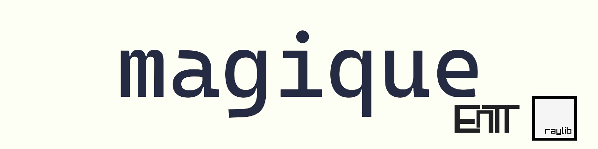

[](https://discord.gg/YAsvnxAmX7)


> _What if raylib was an engine? ..._

`magique` is a beginner-friendly cross-platform 2D game engine for programmers (or those yet to be!) written in **C++ 20**.
It's carefully designed to be **intuitive and easy to learn**, at installation through development and up to sharing the
finished game. By using a small **stack of proven libraries** and many **custom crafted modules** it aims to answer all game
development needs in definitive way both in **performance and usability**.

Join the [official discord](https://discord.gg/YAsvnxAmX7) for questions, suggestions and discussions.

---

Most notable features:

- **Easy to learn and use**
    - All `raylib` functionalities are fully functional allowing for an easy transition
    - _**_Fully documented headers_**_ and GitHub wiki
    - Multiple example games included (see examples/)
    - Beginner-friendly public API optimized for usability
    - Robust logging and error handling with debugger support
    - **Batteries included engine** (all dependencies in the source)
- **Fast and modern**
    - Internally uses _**custom datastructures and algorithms**_ to provide maximum performance
    - Explicitly _**optimized for compile time**_ internally and externally!
    - Takes advantage of _**multithreading, SIMD, data-driven design and cache locality**_ where possible
- **Large feature set with `pay for what you use` policy**
    - Asset-Packing and Loading with **compression and encryption support**
    - Automatic texture stitching into configurable atlases
    - Task based loading interface handling load-priority and background loading of assets
    - _**Procedural particle system**_ inspired by Godot4
    - Persistence API for gamesaves, gameconfigs and database emulator
    - Typesafe C++ scripting system allowing for custom methods and classes with native speed
    - Out of the box support for _**[Tiled](https://www.mapeditor.org/) exports**_ (.tmx, .tsx)
    - Object-oriented UI framework handling layering with extendable built-in controls
    - _**Achievements, CommandLine, NoiseGeneration, 2DSound, AIAgent, VirtualClock, and many more!**_
- **Multiplayer support**
    - Seamless transition between local and global networking with a custom unified API
- **Steam integration**
    - Provided a Steam SDK, allows access to _**steam features**_ like matchmaking and chat

`magique` is using the following popular libraries:

- **[raylib](https://github.com/raysan5/raylib):** rendering, resource loading, sound,...
- **[EnTT](https://github.com/skypjack/entt):** fast and modern entity-component system
- **[ankerl](https://github.com/martinus/unordered_dense):** optimized dense hashmap and hashset
- **[FastNoiseLite](https://github.com/Auburn/FastNoiseLite):** fast and easy noise generation
- **[GameNetworkingSockets](https://github.com/ValveSoftware/GameNetworkingSockets):** local networking via IP
- **[Steam SDK](https://partner.steamgames.com/)** _(if provided)_:  steam features and global P2P networking

### Minimal Example

```c++
using namespace magique;
struct MyGame final : Game
{
    void updateGame(GameState gameState) override { printf("Hello World!\n"); }
    void drawGame(GameState gameState, Camera2D& camera) override { DrawRectangle(0, 0, 50, 50, RED); }
};

int main()
{
    MyGame game{};
    return game.run();
}
```

### 1. Installation

`magique` is using CMake as its build system and it's recommended for projects using it as well.

#### CMake (recommended)

When using CMake just download or clone this repository and add the directory to your project with:

```cmake
add_subdirectory(path/to/magique)
# Your project add_executable(MyGame main.cpp)
target_link_libraries(MyGame PRIVATE magique)
```

This will automatically build magique with your project and set up the include path. Don't forget to link your project
against `magique`! This approach will automatically build for the platform your using.
Check the wiki for optional CMake flags you can set before adding magique.

#### Prebuilt binaries / Custom

The other option is to download the prebuilt binaries for your platform and link your program against them.

**Feel free to copy single headers, implementations or modules in any combination, as the license allows. A lot of the
modules can easily be
made into
standalone units.**

### 2. Documentation

There are 2 main ways magique is documented:

- **In-Header Documentation**
    - Each public function or struct comes with a comment or description
    - Tags are used to provide more insight:
        - `Note:` A helpful sidenote about usage, behavior, relation to other methods or common errors
        - `Default:` The default value or behavior for that method or struct
        - `Failure:` The behavior or return value if the method fails its purpose
        - `Example:` Shows how this method or struct is correctly used
        - `IMPORTANT:` Points out crucial information like unique behavior or pitfalls
- **GitHub Wiki**
    - Written like a tutorial and focuses on general examples rather than individual methods
    - Each module has its own page plus additional pages for combined functionality and extras

If you're a newcomer to gamedev or C++ you should start with the Getting Started page in the wiki.
Contrary if you have experience with the concepts the in-header documentation will likely be enough to guide you.

### 3. Paradigms and design philosophy of `magique`:

- 1 Main Thread + Job System
    - Main thread handles calling render and update functions correctly
    - Job system allows to submit and await concurrent work packages

- Fixed update tick rate
    - Default is 60 updates per second
- Variable render rate
    - Supports any framerate (60-240fps)
- Entity Component System